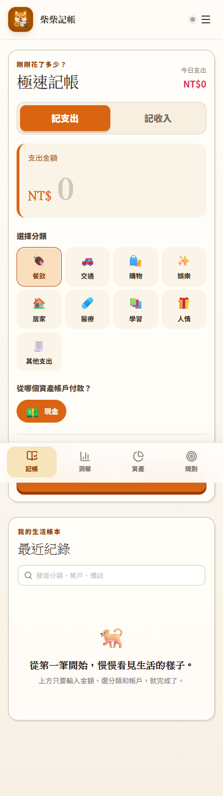
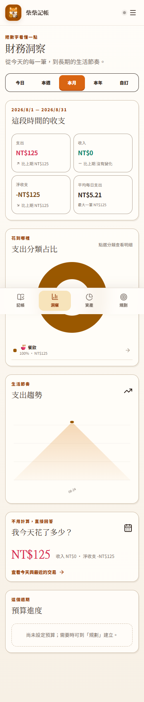

<p align="center">
  
</p>

<h1 align="center">柴柴記帳</h1>

<p align="center"><strong>日子有跡，心裡有底。</strong></p>

<p align="center">
  一個為台灣日常設計的個人財務 PWA：三個選擇記下一筆，慢慢看懂錢去了哪裡、現在放在哪裡。
</p>

<p align="center">
  <a href="#快速開始">快速開始</a> ·
  <a href="#產品體驗">產品體驗</a> ·
  <a href="#資料與同步">資料與同步</a> ·
  <a href="docs/UX_PARITY_AUDIT.md">UX parity audit</a>
</p>

<table>
  <tr>
    <td width="50%"></td>
    <td width="50%"></td>
  </tr>
  <tr>
    <td align="center"><strong>極速記帳</strong><br />金額 → 分類 → 資產帳戶</td>
    <td align="center"><strong>財務洞察</strong><br />期間、分類占比、趨勢與逐筆探索</td>
  </tr>
</table>

## 為什麼是柴柴記帳

- **真的快**：金額是主角；常用分類與資產帳戶直接點選，時間預設現在，備註收在次要層級。
- **真的懂你的錢**：分類回答「為什麼花」，資產帳戶回答「錢從哪裡進出」，介面不要求使用者先學財務術語。
- **真的能探索**：今日、本週、本月、本年與自訂期間，支援收支、淨額、前期比較、donut 分類占比、面積趨勢與逐筆明細。
- **真的離線可用**：訪客模式不需要帳號；登入後才開啟擁有者隔離的跨裝置同步。
- **真的可復原**：完整 JSON 備份、安全合併或明確取代還原；交易 CSV 可供自行整理。

## 產品體驗

### 記帳

支出／收入切換、主角式金額輸入、分類大按鈕、資產帳戶 chip、最近選擇保留，以及可展開的時間／備註。最近紀錄支援搜尋、編輯、刪除與漸進載入完整歷史。

### 洞察

固定回答「我今天花了多少」，再依期間查看收入、支出、淨收支、平均每日支出、最大支出與前期差異。分類 donut 可點入逐筆明細；面積折線圖會依時間跨度減少標籤，避免手機塞滿。

### 資產

獨立呈現總資產、各帳戶占比與明細。建立帳戶時可從現金、銀行、電子支付、儲值卡與其他資產開始；帳戶盤點差異會留下獨立調整紀錄，不會被誤算成收入或支出。

### 規劃

儲蓄目標、週／月預算與固定收支集中在同一個使用者 mental model。配置到目標只是 earmark，不會讓總資產消失；週期收支可暫停、恢復並安全補齊。

### 第一次使用與 App 內說明

四步可跳過 onboarding 說明快速記帳、帳戶／分類、洞察與同步。右上角帳戶選單明確呈現登入身分、同步狀態與下一步；「設定與說明」內含 FAQ、分類管理、資料備份與重要操作說明。

## 資料與同步

```text
帳戶餘額   = 起始金額 + 收入 - 支出 + 餘額調整
總資產     = 所有啟用且計入總資產的帳戶餘額
可配置資產 = 總資產 - 已配置儲蓄
```

- 訪客資料保存在瀏覽器 localStorage；清除網站資料可能移除它，請定期下載 JSON 備份。
- Google 登入後使用 Supabase 同步；訪客資料不會自動混入登入帳本，必須明確選擇匯入或保持分開。
- 每位使用者有獨立快照、原子待同步佇列、刪除防復活、衝突偵測與 owner isolation。
- 本機快照驗證失敗時進入復原保護，停止修改與同步並保留原始內容供下載。
- 完整安全語義、migration 與回復流程見 [CODEX_BUILD_SPEC.md](CODEX_BUILD_SPEC.md)、[QUALITY_REPORT.md](QUALITY_REPORT.md) 與 [supabase/ROLLBACK.md](supabase/ROLLBACK.md)。

## 快速開始

需求：Node.js 24、npm 11。

```powershell
npm.cmd ci
Copy-Item .env.example .env.local
npm.cmd run dev
```

開啟 <http://localhost:8888>。沒有設定 Supabase 時仍可完整使用訪客離線模式。

### 雲端同步環境變數

| 變數 | 用途 |
| --- | --- |
| `VITE_SUPABASE_URL` | Supabase 專案 URL |
| `VITE_SUPABASE_ANON_KEY` | 前端可公開的 publishable／anon key |

任何 `VITE_` 值都會進入瀏覽器 bundle；不要放入 `service_role`、資料庫密碼或 OAuth client secret。

## 驗證

```powershell
npm.cmd run lint
npm.cmd test
npm.cmd run verify:migration
npm.cmd run build
npm.cmd audit --audit-level=high
```

目前測試涵蓋財務金額、日期區間、預算、週期規則、備份還原、舊資料轉換、同步衝突、owner isolation、遠端 adapter 與主要 UI 呈現。CI 會在 pull request、`main` 與 `codex/**` push 執行乾淨安裝與 release checks。

## 技術結構

- React 19、TypeScript、Vite、Tailwind CSS、Lucide icons
- `src/domain/`：可測試的財務、日期、預算、週期、備份與同步深層模組
- `src/app/`：狀態協調、同步安全與產品呈現
- `src/components/`：記帳、洞察、資產、規劃與設定畫面
- Supabase + RLS：登入後的遠端資料 adapter 與擁有者隔離
- Vite PWA：安裝、預快取與離線 App shell

## 已知範圍

目前不支援轉帳、多幣別、信用卡債務、銀行串接、OCR、CSV 匯入或家庭共享。週期收支在開啟 App、回到前景或跨日後補齊，不是背景排程服務。第二支 server resource guard migration 仍需另行授權，尚未套用 production；詳細狀態請見 [supabase/ROLLBACK.md](supabase/ROLLBACK.md)。
